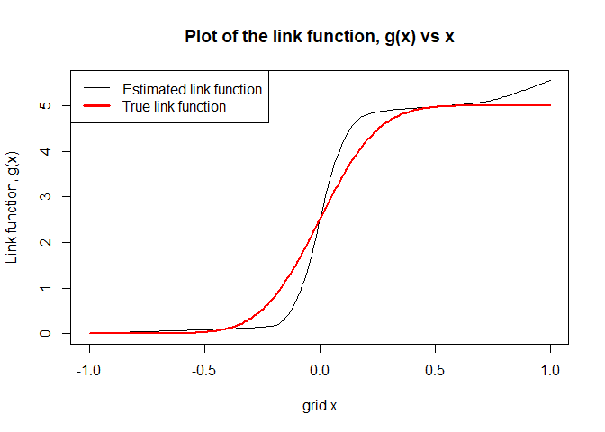

Bayesian Estimation of Monotone Single Index Models
================
Snigdha Das

## Overview

The package `monotoneSIM` performs Bayesian estimation using B-Spline
basis approximation of a Single Index Model where the unknown link
function is assumed to be monotonically increasing. Consider a Single
index models of the form:
*y* = *g*(*x*<sup>⊤</sup>*β*) + *ϵ*

where *y*: response, *x*: p-dimensional predictors, *β*: p-dimensional
coefficient vector, *ϵ*: independent N(0, *σ*<sub>*ϵ*</sub><sup>2</sup>)
random errors, *g*: unknown monotone link function. To construct a prior
on *g*, we consider the basis expansion:
*g*(*x*) = *Σ*<sub>*l* = 0</sub><sup>*L*</sup> *ξ*<sub>*l*</sub> *ψ*<sub>*l*</sub>(*x*),
where
*ψ*<sub>*l*</sub>(*x*) = ∫<sub> − 1</sub><sup>*x*</sup>*h*<sub>*l*</sub>(*t*) d*t*
, *h*<sub>*l*</sub> is a B-Spline basis function of order 2. Then, *g*
is monotonically increasing if and only if *ξ*<sub>*l*</sub> ≥ 0 ∀ *l*,
thereby enforcing the monotonicity constraint in an equivalent way.

Note: Here *g*(*x*) = 0, when *x* ≤  − 1 and *g*(*x*) = *g*(1), when
*x* ≥ 1. The matrix of predictors is scaled so that every row has
euclidean norm  ≤ 1 and euclidean norm of *β* is taken to be 1 so that
\|*x*<sup>⊤</sup>*β*\| ≤ 1.

## Functionality

The package provides two functions.

-   The main function `monotoneSIM` performs a Markov Chain Monte Carlo
    algorithm to generate samples from the conditional posterior
    distribution of unknown parameters in a monotone Single Index
    Model - the unknown parameters being B-Spline basis coefficients
    that approximate the unknown link function, the single index
    parameter and the error variance of the model.

-   The other function `monotoneFIT` calculates fitted values of the
    response using posterior mean of the single index parameter after
    generating an MCMC sample using the function `monotoneSIM`. It also
    returns the estimated link function of the model based on basis
    coefficients for a grid of supplied values.

## Installation

To install this package from Github, run the following in your R
console:

``` r
devtools::install_github("das-snigdha/monotoneSIM")
```

## An Example Demonstrating Usage

This package shall be implemented on the following simulated data.

``` r
n = 100; p = 3; L = 20

# We take 2 continuous variables and 1 dichotomous attribute as predictors.
X = matrix(rnorm(n*(p-1)), nrow = n, ncol = (p-1))
X = cbind(X, rbinom(n, 1, 0.5))

# True Value of the parameter (having unit euclidean norm).
true.beta = rnorm(p); true.beta = true.beta/ norm(true.beta, "2")

# True monotone increasing link function
true.g = function(x){
y = (x+1)/2
5*(pnorm(y, mean=0.5, sd=0.1) - pnorm(0, mean = 0.5, sd = 0.1))
}

# Generate the response
y.true = true.g(X%*%true.beta) + rnorm(n, 0, sqrt(0.01))
```

Choose values of hyperparameters and starting values of parameters to
apply `monotoneSIM` as follows:

``` r
beta.start = rnorm(p)  #Starting value of beta
xi = abs(rnorm((L+1), 0, 5))   #Starting value of xi
S_xi = 5*diag(L+1) #Prior Variance of xi
sigma.sq.eps.start = 0.01 #Starting value of sigma.sq.eps

library(monotoneSIM)
MCMC.sample = monotoneSIM(y = y.true, X = X, beta.init = beta.start,
                          xi.init = xi, Sigma.xi =  S_xi, monotone = TRUE,
                          sigma.sq.eps.init = sigma.sq.eps.start, 
                          Burn.in = 100, M = 500)
```

Using the MCMC sample generated by `monotoneSIM`, we may draw several
inferences on the unknown components of the model. For example, the
single index parameter *β* can be estimated using the posterior mean of
the MCMC sample on *β*, as shown below:

``` r
#Posterior mean of beta
beta.estimated = colMeans(MCMC.sample$beta); beta.estimated
```

    ## [1] 0.99237389 0.00596425 0.12158470

``` r
true.beta  #Compare with true beta
```

    ## [1] 0.99041581 0.01477206 0.13732559

``` r
#Posterior Standard Deviation of beta
sd.beta = apply(MCMC.sample$beta, 2, sd); sd.beta
```

    ## [1] 0.002069747 0.009242075 0.016932202

Once the MCMC sample has been obtained, the function `monotoneFIT` is
used to extract fitted values of the response and to estimate the link
function for a grid of supplied values.

``` r
fit = monotoneFIT(MCMC.sample, size.grid.x = 200)

# Obtain the fitted response
y.fit = colMeans(fit$Y.fitted)
```

Having obtained the fitted responses, the Mean Sqaured Error may be
calculated to comment on the goodness of fit or one may graphically
visualize the true response and the fitted model as shown below:

    ## [1] "MSE =  0.0382548781184165"

<!-- -->

Finally, an estimate of the link function is obtained as :

``` r
# Obtain the estimated value of the link function g(x)
est.func = colMeans(fit$link.estimated)
```

One can graphically look at the functional form of the the estimated
link function by plotting it againt `grid.x`

<!-- -->
